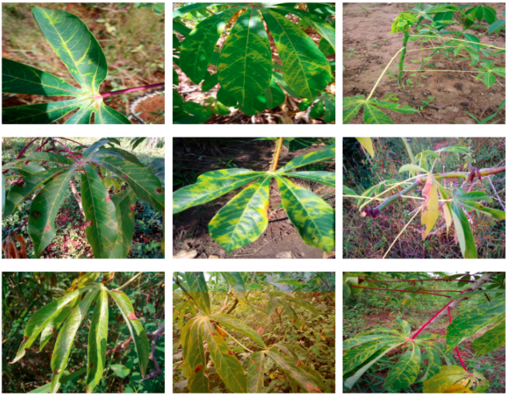
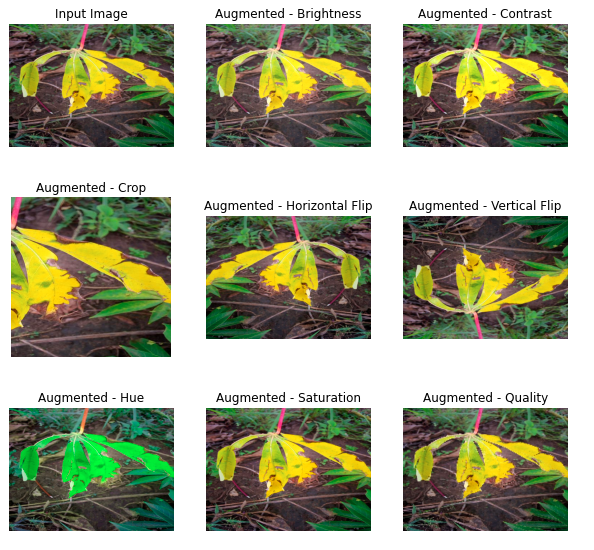
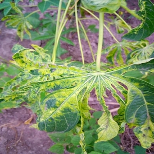
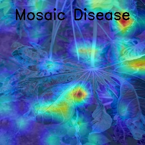
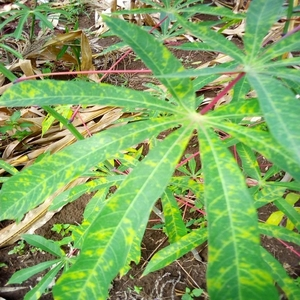
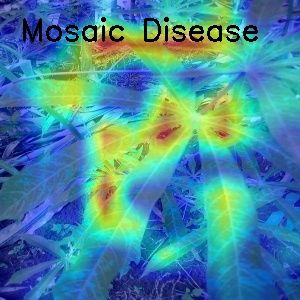
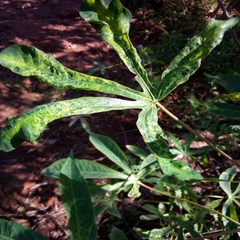
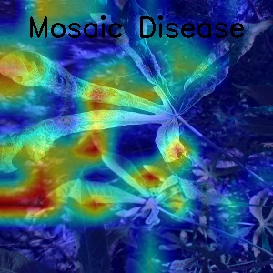
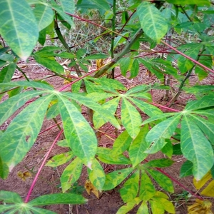
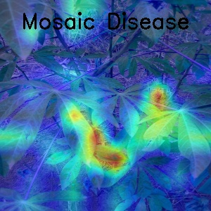

# **🌿 Cassvana Leaf Disease Classification**
Kaggle Competition: https://www.kaggle.com/c/cassava-leaf-disease-classification


## **Dataset**
- **Train set:** ~26,000 images (21367 images of the 2020 contest was merged with 500 images from the 2019 contest).
- **Test set:** ~15,000 images.
- **Public test:** 31% of the test set.
- **Private test:** 69% of the test set.

**The dataset is imbalanced with 5 labels:**
1. Cassava Bacterial Blight (CBB)
2. Cassava Brown Streak Disease (CBSD)
3. Cassava Green Mottle (CGM)
4. Cassava Mosaic Disease (CMD)
5. Healthy

|  |
| :-----------------------: |
| **Original data images**  |

|  |
| :-------------------------------: |
|     **After albumentations**      |

## **Requirements**

Python >= 3.8. Run this command to install all the dependencies:
```
pip install -r requirements.txt
```


## **Directories Structures**

```
  this repo
  └───  train_images                        
  │     └───  ***.png                    # Dataset folder   
  └───  test_images                        
  │     └───  ***.png              
  |
  └───  configs                 # Config folder                                          
  │     └─── train.yaml
  │     └─── test.yaml
  │     └─── config.py
  |              
  └───  csv                   # labels folder               
  │     └─── folds
  │         └─── fold_train.csv
  │         └─── fold_val.csv
  │                     
  └───  loggers                    # experiments folder               
  │     └─── runs
  │         └─── loss_fold
  |         └─── acc_fold        
  └───  weights                    # experiments folder               
  │     └─── model_name1.pth 
  |     └───  ...   
  |     
  |            
  train.py
  test.py
```


## **Edit YAML**
**Full explanation on each YAML file**


## **Training Steps**
1. Download and unzip dataset from https://www.kaggle.com/c/cassava-leaf-disease-classification/data
2. Run this command to split train.csv using KFold. A folder name 'csv' will be created with different k-folds
```
python utils/tools/split_kfold.py --csv=train.csv --seed=42 --out=csv --n_splits=5 --shuffle=True 
```
3. Run this command on terminal or colaboratory (change if needed)
```
tensorboard --logdir='./loggers/runs'
```
1. Run this command and fine-tune on parameters for fully train observation (Require change)
```
python train.py --config=config_name --resume=weight_path --print_per_iters=100 --gradcam_visualization
```
5. The model weights will be saved automatically in the 'weights' folder

## **Inference**

Run this command to generate predictions and submission file (Require fine-tune inside)
```
python test.py --config=test
```

## Result
I have trained on **Efficientnet-b6**, **EfficientNet-b1** and **ViT**. Here are the results:
1. The result from **Efficientnet-b6** is not quite good, accuracy just between **0.7-0.8** before Early Stopping.
2. The result from **Efficientnet-b1** and **ViT** are good enough: about **0.87x** each.
3. **Some visualization for Mosaic Disease with GradCam**  

 | 

 | 

 | 

 | 


## **To-do list:**

- [x] Multi-GPU support (nn.DataParallel)
- [x] GradCAM vizualization
- [x] Gradient Accumulation
- [x] Mixed precision
- [x] Stratified KFold splitting 
- [x] Inference with Ensemble Model technique and TTA
- [x] Metrics: Accuracy, Balanced Accuracy, F1-Score
- [x] Losses: Focal Loss, SmoothCrossEntropy Loss
- [x] Optimizer: AdamW, SGD. Adas, SAM (not debug yet)
- [x] Scheduler: ReduceLROnPlateau, CosineAnnealingWarmRestarts
- [x] Usable Models: Vit, EfficientNet, Resnext, Densenet
- [x] Early Stopping on training


## **Reference:**
Make sure to give them a star
- Template from: https://github.com/kaylode/custom-template
- timm models from https://github.com/rwightman/pytorch-image-models
